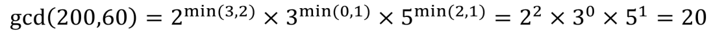
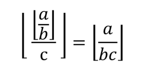

<script type="text/javascript" src="http: //cdn.mathjax.org/mathjax/latest/MathJax.js?config=default"></script>
# 知识


Jetbrain全家桶牛逼

## 复杂度分析

O(log(n))   10 ^ 12(long long)\
O(n)        10 ^ 7\
O(n*log(n)) 5 * 10 ^ 5\
O(n^2)      5000\
O(n^3)      500\
O(2^n)      24\
O(n!)       12

### 主定理

规模为N的问题, 分治得到a个规模为N/b的问题, 每次递归带来c(N^d)的额外运算.\
T(N) <= a * T(N/b) + c(N^d)\
\
当a = b ^ d, T(N) = O(N^d*log(N))\
当a < b ^ d, T(N) = O(N^d)\
当a > b ^ d, T(N) = O(N^(log(a)/log(b)))

## 中国剩余定理(POJ1006)

已知取模结果与对同一数的互质模数, 求解原数\
取除 i 外 n-1 个模数相乘 = M[i],求解 M[i] * x[i] % i = 1 中 x[i]\
原数 = Σ(M[i] * x[i] * i对应的取模结果) % n个模数相乘


## 调和级数(POJ1003)

Σ(1/i) (i<=n)\
约等于 ln(1+n) + R (R(欧拉常数) = 0.5772156649...)

## 逻辑关系: 蕴含(Imply)(POJ3295)

A ==> B <=> (!A)||B

## n皇后(POJ3239)

> M皇后问题:  在M×M格的国际象棋上摆放M个皇后, 使其不能互相攻击, 即任意两个皇后都不能处于同一行、同一列或同一斜线上.\
根据场景, 又有三种衍生问题: \
① 共有多少种摆法（即有多少种可行解）\
② 求出所有可行解\
③ 求任意一个可行解\
问题① 属于 禁位排列 问题, 目前是存在通项公式直接求解的.\
问题② 属于 搜索 问题, 在网上也有多种解法, 主流是 回溯法（另有衍生的位运算变种算法）, 但不管如何优化, 回溯法都有一个致命的问题: M值不能过大（一般M=30已是极限）.\
问题③ 属于 问题② 的子集, 因此很多人的切入点依然是回溯法, 也有启发式算法的解法: 如遗传算法、还有刘汝佳在《算法艺术与信息学竞赛》提出的启发式修补算法.\
用构造法（即通过分析问题潜在的数学规律直接得到解/瞎猜）的通解公式, 时间复杂度为O(1) (特解)


### LowBit

> a & -a.它称为 LowBit 操作, 可以提取出 a 中最右边一个 1 的位置.\
LowBit 操作可以用来枚举一个 bit array 中的所有 1: 

```
while a != 0: 
    p = a & -a
    a ^= p
    Do something with p
```

## 排序不等式(排队接水)

两个序列, 逆序相乘求和是最小值, 顺序相乘求和是最大值.

## Huffman编码\Huffman树

考虑这样一种压缩算法: 将每个字符用长短不一的二进制数来表示.\
要求任一字符的编码都不能是另一字符编码的前缀, 这种编码称为前缀编码（其实是非前缀码）.\
压缩后的总长度 = 每个字符出现次数 * 它的码长（树上到根的距离）(字典树/Huffman树)\
给定n个权值作为n个叶子结点, 构造一棵二叉树, 若树的带权路径长度达到最小, 则这棵树被称为Huffman树.

> \
编码:  A: 0, C: 10, B: 110, D: 111

> (01) 路径和路径长度\
  定义: 在一棵树中, 从一个结点往下可以达到的孩子或孙子结点之间的通路, 称为路径.通路中分支的数目称为路径长度.若规定根结点的层数为1, 则从根结点到第L层结点的路径长度为L-1. \
  例子: 100和80的路径长度是1, 50和30的路径长度是2, 20和10的路径长度是3.\
  (02) 结点的权及带权路径长度\
  定义: 若将树中结点赋给一个有着某种含义的数值, 则这个数值称为该结点的权.结点的带权路径长度为: 从根结点到该结点之间的路径长度与该结点的权的乘积. \
  (03) 树的带权路径长度\
  定义: 树的带权路径长度规定为所有叶子结点的带权路径长度之和, 记为WPL. \
  例子: 示例中, 树的WPL= 1 * 100 + 2 * 80 + 3 * 20 + 3 * 10 = 100 + 160 + 60 + 30 = 350.\

建立方法/证明: 
根据直觉, 应该让出现次数多的字符码长更短, 反之亦然\
引理: 存在一种最优方案, 使得出现次数最少的两个字符深度相同, 且在树上为兄弟\
那么将这两个字符合并, 看成一个字符, 但每当它们出现时需要额外的一个码长来分辨

> n个权值分别设为 w1、w2、…、wn, 哈夫曼树的构造规则为: \
1.将w1、w2、…, wn看成是有n 棵树的森林(每棵树仅有一个结点)； \
2.在森林中选出根结点的权值最小的两棵树进行合并, 作为一棵新树的左、右子树, 且新树的根结点权值为其左、右子树根结点权值之和； \
3.从森林中删除选取的两棵树, 并将新树加入森林； \
4.重复(02)、(03)步, 直到森林中只剩一棵树为止, 该树即为所求得的Huffman树.


## 快速傅里叶变换(FFT)

### 多项式乘法的卷积形式

A(x)升幂系数为a, B(x)升幂系数为b.那么C(x) = A(x) * B(x)的系数为


朴素复杂度O(n^2)

### 多项式乘法的点乘形式

> 原本的多项式是系数表示法, 现在我们换个思路, 将其转化为点值表示法.即我们可以把多项式f(x)看作在平面直角坐标系上的函数f(x), 那么这个n阶函数就可以由n+1个点唯一确定.\
这n+1个点是随意选取的---只要求它们相异即可.

因为两个n阶多项式相乘有2n+1项,所以需要通过补点实现多项式乘法.


### 多项式点值形式转换为系数形式

求值计算的逆(从一个多项式的点值表示确定其系数表示中的系数)称为插值(interpolation)


矩阵求逆: 朴素O(n^3)

#### 拉格朗日插值公式


### 单位复根

对n次方程w^n=1, 有n个复数域根, 模长为1, 在复数平面上均匀分布, 由欧拉公式: 


称为主次单位根.其整次幂为其他单位根.


### 离散傅里叶变换(DFT)

对n-1阶多项式A(x), A = (a0, a1,..., a(n-1))\
通过高次幂补零使n为2的幂.


即对应系数向量(a1, a2,..., a(n-1))的离散型傅里叶变换.复杂度O(n)

### FFT求值

将A(x)拆分为两个多项式.


A0(x)存储的是所有偶数位(二进制位最后一位是0), 而A1(x)存储的是所有的奇数位(二进制位最后一位是1).有: 


对n个单位根, 计算其中一根, 通过折半定理映射出另一根, 降低了计算的复杂度为O(log(n)).


```
int Lim = 1, N, M ;
function FFT(int lenth, complex *A, int flag){
    IF (Lim == 1) return ;
    complex A0[lenth >> 1], A1[lenth >> 1] ;//分成两部分
    for(int j :  0 to lenth by_grow 2) A0[j >> 1] = A[j], A1[j >> 1] = A[j + 1] ;
    FFT(lenth >> 1, A0, flag) ;
    FFT(lenth >> 1, A1, flag) ;
    complex Wn = unit(,) , w = (1, 0) ;//Wn是单位根, w用来枚举幂, 即我们令主次单位根不变, 由于其余单位根都是其整次幂, 所以可以用一个w来记录到第几次幂
        /*此处求单位根的时候会用到我们的参数flag……嗯没错就用这一次, 并且flag的值域为(-1, 1)……是的, 只会有两个值*/
    for(int i :  0 to (lenth >> 1) by_grow 1 with w = w * Wn){
        A[i] = A0[i] + A1[i] * w ;//应用公式, 下同 
        A[i + (lenth >> 1)] = A0[i] - A1[i] * w ; //顺便求出另一半, 由折半引理可显然. 
    } 
} 
function Main{
    input(N), input(M) ;
    for(i :  0 to N by_grow 1) => input(A) ;
    for(i :  0 to M by_grow 1) => input(B) ; 
    while(Lim < N + M) Lim << = 1 ;//Lim为结果多项式的长度（暂时）, 化为2的幂的便于分治（二分）
    FFT(Lim, A, 1) ;//两遍FFT表示从系数化为点值 
    FFT(Lim, B, 1) ;
    for(i :  0 to Lim by_grow 2) => A[i] *= B[i] ;//点乘法, 此处需要重定义乘号, 因为每一项现在表示的是一个点, 有x和y两个属性qwq 
}
```

Tips: unit(, ) ==> 单位复根

### 逆离散傅里叶变换IDFT


范德蒙矩阵.

### FFT插值


Tips:  C++提供了complex复数容器.
complex.real(), complex.imag().

```cpp
void FFT(int Lim,complex *A,int flag){
    if(Lim == 1) return ;
    complex A0[Lim >> 1], A1[Lim >> 1] ;
    for(int i = 0; i <= Lim ; i += 2)
        A0[i >> 1] = A[i], A1[i >> 1] = A[i+1] ;
    FFT(Lim >> 1, A0, flag) ;
    FFT(Lim >> 1, A1, flag) ;
    complex unit = complex(cos(2.0 * Pi / Lim) , flag * sin(2.0 * Pi / Lim)), w = complex(1, 0) ;//欧拉公式 
    for(int i = 0;i < (Lim >> 1) ; i ++, w = w * unit) {
        A[i] = A0[i] + w * A1[i] ;
        A[i + (Lim>>1)] = A0[i] - w * A1[i];
    }
}
int main(){
    FFT(A, 1), FFT(B, 1) ;
    for(i = 0; i <= Lim; i++) 
        A[i] = A[i] * B[i] ;
    FFT(A, -1) ;
}
```

### 优化

#### 蝴蝶操作

w * A1[i] 被复用, 用temp储存.\
用迭代方法实现迭代顺序的FFT.

> 三层for, 先枚举区间长度（1, 2, 4, 8……）, 第二层枚举每个区间的起点（其实只有两段）, 第三层负责遍历每段区间

```
for(j = 1; j < Lim; j << = 1){ //A0, A1可行长度
        node T(cos(Pi / j), flag * sin(Pi / j)) ;
        for(k = 0; k < Lim; k += (j << 1) ){ //A起始节点
            node t(1, 0) ;
            for(l = 0 ; l < j; l++, t = t * T){ //区间内遍历
                node Nx = J[k + l], Ny = t * J[k + j + l] ;
                J[k + l] = Nx + Ny ;
                J[k + j + l] = Nx - Ny ;
            }
        }
    }
```

#### 蝴蝶定理

构建系数FFT的迭代树, 有新的排序.


原来的序号 0  1  2  3  4  5  6  7\
现在的序号 0  4  2  6  1  5  3  7\
原来的二进制表示 000  001  010  011  100  101  110  111\
现在的二进制表示 000  100  010  110  100  101  011  111\
新的排序的reverse是原排序的取反.\
此即蝴蝶定理.

```
while(Lim <= N + M) 
    Lim << = 1, L++ ;
for(i = 0; i < Lim; i++) 
    R[i] = (R[i >> 1] >> 1) | ((i & 1) << (L - 1)) ;  \\?
```

## BigInteger/高精度（POJ1001）

### 模拟手算


### FFT

## DP/背包问题（背包九讲）

**一个正确的状态转移方程的求解过程遍历了所有可用的策略, 也就覆盖了问题的所有方案.**

### 01背包

有 N 件物品和一个容量为 V 的背包.放入第 i 件物品耗费的费用是 Ci, 得到的
价值是 Wi.求解将哪些物品装入背包可使价值总和最大.


空间复杂度可优化O(NV) => O(V) 利用滚动数组叠加第i个物品的选择.\
F[i, v]与F[i - 1, v - c]和F[i - 1, v]有关,所以需要向前遍历保证无后效性(只放一次).

要求装满时, 除v = 0时, 其他初始化为-INF.
要求价值时, 整体初始化为0.


### 完全背包

有 N 种物品和一个容量为 V 的背包, 每种物品都有无限件可用.放入第 i 种物品
的费用是 Ci, 价值是 Wi.求解: 将哪些物品装入背包, 可使这些物品的耗费的费用总
和不超过背包容量, 且价值总和最大.


若存在物品i, Wi 较物品j高, Ci 较物品j低, 则可去除物品j.

转换为01背包问题: 
> 更高效的转化方法是: 把第 i 种物品拆成费用为 2^k * Ci、价值为 2^k * Wi 的若干件物品, 其中 k 取遍满足 2^k * Ci <= V 的非负整数.\
这是二进制的思想.因为, 不管最优策略选几件第 i 种物品, 其件数写成二进制后, 总可以表示成若干个 2^k 件物品的和.\
这样一来就把每种物品拆成 O(log[V /Ci]) 件物品, 是一个很大的改进.


复杂度 O(NV)

完全背包的转移方程可以转换为


v较小时对v较大时有影响. 因此, 对第i个物品的选择具有后效性, 因此对v向前遍历(多次选择).

### 多重背包

有 N 种物品和一个容量为 V 的背包.第 i 种物品最多有 Mi 件可用, 每件耗费的
空间是 Ci, 价值是 Wi.求解将哪些物品装入背包可使这些物品的耗费的空间总和不超
过背包容量, 且价值总和最大.


转换为01背包问题
> 方法是: 将第 i 种物品分成若干件 01 背包中的物品, 其中每件物品有一个系数.这件物品的费用和价值均是原来的费用和价值乘以这个系数.\
令这些系数分别为1, 2, 2^2, ..., 2^(k−1), Mi − 2^k + 1, 且 k 是满足 Mi − 2^k + 1 > 0 的最大整数.\
例如, 如果 Mi为 13, 则相应的 k = 3, 这种最多取 13 件的物品应被分成系数分别为 1, 2, 4, 6 的四件物品.\
这样就将第 i 种物品分成了 O(logMi) 种物品, 将原问题转化为了复杂度为O(VΣ(logMi)) 的 01 背包问题


> 当问题是"每种有若干件的物品能否填满给定容量的背包", 只须考虑填满背包的可行性, 不需考虑每件物品的价值时, 多重背包问题同样有 O(NV) 复杂度的算法.

无视价值, F[i, v]为用前i种物品填满容量为v的背包后第i种物品剩余数量.


### 二维背包

对于每件物品, 具有两种不同的费用, 选择这件物品必须同时付出这两种费用.对于每种费用都有一个可付出的最大值（背包容量）.问怎样选择物品可以得到最大的价值.\
设第 i 件物品所需的两种费用分别为 Ci 和 Di.两种费用可付出的最大值（也即两种背包容量）分别为 V 和 U.物品的价值为 Wi.


> 如前述优化空间复杂度的方法, 可以只使用二维的数组: 当每件物品只可以取一次时变量 v 和 u 采用逆序的循环, 当物品有如完全背包问题时采用顺序的循环, 当物品有如多重背包问题时拆分物品.

> 有时, "二维费用"的条件是以这样一种隐含的方式给出的: 最多只能取 U 件物品.这事实上相当于每件物品多了一种"件数"的费用, 每个物品的件数费用均为 1, 可以付出的最大件数费用为 U.

### 分组背包

有 N 件物品和一个容量为 V 的背包.第 i 件物品的费用是 Ci, 价值是 Wi.这些物品被划分为 K 组, 每组中的物品互相冲突, 最多选一件.求解将哪些物品装入背包可使这些物品的费用总和不超过背包容量, 且价值总和最大.


### 依赖背包

物品 i 依赖于物品 j, 表示若选物品 i, 则必须选物品 j.为了简化起见, 我们先设没有某个物品既依赖于别的物品, 又被别的物品所依赖；另外, 没有某件物品同时依赖多件物品.

> 所以, 可以对主件 k 的"附件集合"先进行一次 01 背包, 得到费用依次为 0,..., V − Ck 所有这些值时相应的最大价值 Fk[0,..., V −Ck].\
那么, 这个主件及它的附件集合相当于 V −Ck + 1 个物品的 物品组, 其中费用为 v 的物品的价值为 Fk[v−Ck] + Wk.

运用01背包, 将附件集合与主件转化为V - Ck + 1个物品的物品组.
依赖关系可由森林数据结构表示.

### 泛化物品

> 没有固定的费用和价值, 而是它的价值随着你分配给它的费用而变化. 这就是泛化物品的概念.

在背包容量为 V 的背包问题中, 泛化物品是一个定义域为 0...V 中的整数的函数 h, 当分配给它的费用为 v 时, 能得到的价值就是 h(v).\
01背包: 一个费用为 c 价值为 w 的物品, h(c) = v, h(!c) = 0\
完全背包: 一个费用为 c 价值为 w 的物品, h(v) = w * v / c (v = k * c), h(!v) = 0\
多重背包: 如果它是多重背包中重复次数最多为 m 的物品, v / c <= m\
分组背包: 
> 一个物品组可以看作一个泛化物品 h.对于一个 0,..., V 中的 v, 若物品组中不存在费用为 v 的物品, 则 h(v) = 0, 否则 h(v) 取值为所有费用为 v 的物品的最大价值.

给定了两个泛化物品 h 和 l, 要用一定的费用从这两个泛化物品中得到最大的价值.


我们将 f 定义为泛化物品 h 和 l 的和: h、l 都是泛化物品, 若函数 f 满足以上关系式, 则称 f 是 h 与 l 的和.\
泛化物品及其运算复杂度O(V^2).

### Tips

#### 最优解方案: 

> 如果要求输出这个最优值的方案, 可以参照一般动态规划问题输出方案的方法: 记录下每个状态的最优值是由状态转移方程的哪一项推出来的, 换句话说, 记录下它是由哪一个策略推出来的.便可根据这条策略找到上一个状态, 从上一个状态接着向前推即可. 

用一数组, 记录对应状态转移时选择的是方程中哪一项.(是否使用了第i件物品)


#### 字典序最小的最优解方案: 

对物品编号做 x <== N + 1 - x 变化 / 逆序构建转移方程\

#### 方案数: 

对于一个给定了背包容量、物品费用、物品间相互关系（分组、依赖等）的背包问题, 可以得到装满背包或将背包装至某一指定容量的方案总数.
> 对于这类改变问法的问题, 一般只需将状态转移方程中的 max 改成 sum 即可.例如若每件物品均是完全背包中的物品, 转移方程即为
\
F[0, 0] = 1.

可行性: \
**一个正确的状态转移方程的求解过程遍历了所有可用的策略, 也就覆盖了问题的所有方案.**

#### 最优方案数: 


G[i, v] 表示这个子问题的最优方案的总数.

#### 第K优解: 

**一个正确的状态转移方程的求解过程遍历了所有可用的策略, 也就覆盖了问题的所有方案.**\
用一个优先队列, 储存主问题的结果更新.复杂度O(VNK).

## 并查集

并查集顾名思义就是有"合并集合"和"查找集合中的元素"两种操作的关于数据结构的一种算法.\
用集合中的某个元素来代表这个集合, 该元素称为集合的代表元.\
通过设置一个有节点指向意义的标记, 说明集合间的合并从属关系.

> \
有bin[1]=0, bin[2]=1, bin[3]=2, bin[4]=2.

借由指向标记, 回溯至该集合代表元, 实现集合元素的查找.\
并查集可以验证图中两点的连通性.

### 路径压缩

把链上所有的点的指向值, 直接指向最终的代表元素.

## 散列表(hash)

哈希表(Hash table, 也叫散列表), 是根据关键码值(Key value)而直接进行访问的数据结构.它通过把关键码值映射到表中一个位置来访问记录, 以加快查找的速度.\
名 散 列 函 数: 取模

> 你有一些朋友, 每个朋友都有一个身份证号.\
需要支持两个操作: \
添加一个新朋友.\
给定身份证号, 问这个人是不是你的朋友.\
一个大小为p的数组.\
Add操作: w[id%p]=1.\
Ask操作: 看w[id%p]是否为1.为1则认为是朋友.

### hash碰撞与多模数hash

假设id%p是完全随机的.那么我们有定理: 期望每√𝑝个表节点中, 有两个表节点的id%p会碰撞.\
取两个模数p1, p2.当且仅当这两个模数同时正确时, 才查询对应节点.\
p一般要取质数.

## 图论

由n个点和边构成的称为图.无向图 <=> 双向图.\
点和边可能具有权值.\
u ==w==> v\
有n-1条边的称为树.树无环全联通.

### 建图, 建树

邻接矩阵(edge[u][v] = w)\
vector(vector<edge>[u] = (v, w))\
邻接表\
可以使用vector存子节点建树(vector<int> son[u] = v)

### 遍历

BFS, DFS实现.\
ID(迭代加深搜索) = BFS+DFS, 即限定一个不到尽头的深度进行DFS.

### Bellman-Ford算法/SPFA

### 树与二叉树

树有以下特性:

> (01) 每个节点有零个或多个子节点；\
(02) 没有父节点的节点称为根节点；\
(03) 每一个非根节点有且只有一个父节点；\
(04) 除了根节点外, 每个子节点可以分为多个不相交的子树.\

节点的度(Degree): 节点子树个数.\
叶子: Degree = 0.\
分支节点: Degree != 0.\
树的度: 最大节点度.\
节点层次: 父节点层次 + 1, 根节点层次 = 1.\
树的高度: 最大节点层次.\
有序树/无序树: 节点各子树次序不可/可以改变.\
森林: 多个不相交的树.加根为树.

### 二叉树

二叉树是每个节点最多有两个子树的树结构.它有五种基本形态：二叉树可以是空集；根可以有空的左子树或右子树；或者左、右子树皆为空.\
第i层节点数 < 2 ^ (i - 1)\
高度为K, 节点数 < 2 ^ K - 1\
节点数N, 高度 > log(N + 1)\
叶子节点树N0, 度为2的分支节点数N2, N0 = N2 + 1\
\
满二叉树: 高度为h, 并且由2 ^ h –1个结点的二叉树, 被称为满二叉树.


完全二叉树: 一棵二叉树中, 只有最下面两层结点的度可以小于2, 并且最下一层的叶结点集中在靠左的若干位置上.这样的二叉树称为完全二叉树.


### 二叉树的遍历

前序遍历(Preorder travesal), 中序遍历(Inorder travesal), 后序遍历(postorder travesal).\
前序: 根, 左子树, 右子树.\
中序: 左子树, 根, 右子树.\
后序: 左子树, 右子树, 根.\
递归实现.

### 二叉查找树

二叉查找树(Binary Search Tree), 又被称为二叉搜索树.\
设x为二叉查找树中的一个结点, x节点包含关键字key, 节点x的key值记为key[x].\
如果y是x的左子树中的一个结点, 则key[y] <= key[x], 如果y是x的右子树的一个结点则, key[y] >= key[x].


节点的前驱: 是该节点的左子树中的最大节点.\
节点的后继: 是该节点的右子树中的最小节点.\
对节点的前继:

> x没有左孩子.则x有以下两种可能: \
x是"一个右孩子", 则"x的前驱结点"为 "它的父结点".\
x是"一个左孩子", 则查找"x的最低的父结点, 并且该父结点要具有右孩子", 找到的这个"最低的父结点"就是"x的前驱结点".

对节点的后继:

> x没有右孩子.则x有以下两种可能: \
x是"一个左孩子", 则"x的后继结点"为 "它的父结点".\
x是"一个右孩子", 则查找"x的最低的父结点, 并且该父结点要具有左孩子", 找到的这个"最低的父结点"就是"x的后继结点".

#### 查找

```cpp
\\递归
Node* bstree_search(BSTree x, Type key)
{
    if (x == NULL || x -> key == key)
        return x;

    if (key < x -> key)
        return bstree_search(x -> left, key);
    else
        return bstree_search(x -> right, key);
}
\\非递归
Node* iterative_bstree_search(BSTree x, Type key)
{
    while ((x!=NULL) && (x->key!=key))
    {
        if (key < x->key)
            x = x->left;
        else
            x = x->right;
    }

    return x;
}
```

```cpp
Node* bstree_predecessor(Node *x) //前驱
{
    // 如果x存在左孩子, 则"x的前驱结点"为 "以其左孩子为根的子树的最大结点".
    if (x->left != NULL)
        return bstree_maximum(x->left);

    // 如果x没有左孩子.则x有以下两种可能：
    // (01) x是"一个右孩子", 则"x的前驱结点"为 "它的父结点".
    // (01) x是"一个左孩子", 则查找"x的最低的父结点, 并且该父结点要具有右孩子", 找到的这个"最低的父结点"就是"x的前驱结点".
    Node* y = x->parent;
    while ((y!=NULL) && (x==y->left))
    {
        x = y;
        y = y->parent;
    }

    return y;
}

Node* bstree_successor(Node *x) //后继
{
    // 如果x存在右孩子, 则"x的后继结点"为 "以其右孩子为根的子树的最小结点".
    if (x->right != NULL)
        return bstree_minimum(x->right);

    // 如果x没有右孩子.则x有以下两种可能：
    // (01) x是"一个左孩子", 则"x的后继结点"为 "它的父结点".
    // (02) x是"一个右孩子", 则查找"x的最低的父结点, 并且该父结点要具有左孩子", 找到的这个"最低的父结点"就是"x的后继结点".
    Node* y = x->parent;
    while ((y!=NULL) && (x==y->right))
    {
        x = y;
        y = y->parent;
    }

    return y;
}
```

## 代数基本定理


### 整数除法

正整数除法, 就是把两个数的质因数分解, 然后每个质数的指数相减.


对m|n(整除), 下式需要满足: a1 >= b1, a2 >= b2, ...


### 约数与倍数

一个数满足质因数分解, 那么约数个数d = ∏(r[i] + 1)

### 最大公约数(GCD), 最小公倍数(LCM)

GCD: 




LCM:


由GCD求解LCM更加快速


互质: a ⊥ b表示, <=> GCD(a, b) = 1

## 模(modulo)

### 基本性质(随时取模)

(a + b) % c = (a % c + b % c) % c\
(a * b) % c = (a % c * b % c) % c

### 模意义/同余

我们在式子最后附上(mod p), 表示这个式子是在模意义下成立.
相应地, 将等号改成全等号.

> 36 ≡ 11 (mod 5) <=> 36 % 5 = 11 % 5

定义为同余: \
给定一个正整数m, 如果两个整数a和b满足a-b能够被m整除, 即(a - b) / m得到一个整数, 那么就称整数a与b对模m同余, 记作a ≡ b (mod m).


### 杂性质



### GCD递归定理/辗转相除法


```cpp
int gcd(int a, int b){
    if(b == 0){
        return a;
    }
    return gcd(b, a % b);
}
```

当a, b 为Fibonacci数列时复杂度最高.

## 质数, 筛法

### 质数定理

[1, n]的质数数目约为(n -> INF):


### 质因数分解

一个正整数n最多分解为log(n)个质数.\
大于√n的质数因子至多一个.\
故有朴素方法: 

```cpp
void decompose(int n){
    for(int i = 2; i <= sqrt(n); i++){
        while(!(n % i)){
            n /= i;
            cout << i << " ";
        }
    }
    if(n != 1){
        cout << n;
    }
}
```

复杂度O(n*√n).

### 质数筛法

> 筛掉2的倍数，然后筛掉3的倍数，然后筛掉5的倍数...剩下了的即为质数.

向前递推得质数, 筛质数倍数.\
以下为朴素筛法:

```cpp
void sieve(int n){
    bool notprime[n + 5] = {0};
    for(int i = 2; i <= n; i++){
        if(!notprime[i]){
            for(int j = 2; i * j <= n; j++){
                cout << i << " ";
                notprime[i * j] = 1;
            }
        }
    }
}
```

还有O(n)的线性筛.

### 除法同余与逆元

将 a / b * c (mod p)转换为a * d * c (mod p)意义下的同余处理.\
d为逆元, 记为inv(b).


> 

#### 费马小定理

当p为质数时,


逆元在模质数意义下有

