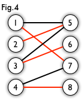
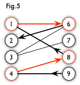

# 知识


Jetbrain全家桶牛逼

## 复杂度分析

O(log(n))   10 ^ 12(long long)

O(n)        10 ^ 7

O(n*log(n)) 5 * 10 ^ 5

O(n^2)      5000

O(n^3)      500

O(2^n)      24

O(n!)       12

### 主定理

规模为N的问题, 分治得到a个规模为N/b的问题, 每次递归带来c(N^d)的额外运算.

T(N) <= a * T(N/b) + c(N^d)

当a = b ^ d, T(N) = O(N^d*log(N))

当a < b ^ d, T(N) = O(N^d)

当a > b ^ d, T(N) = O(N^(log(a)/log(b)))

## 中国剩余定理(POJ1006)

已知取模结果与对同一数的互质模数, 求解原数

取除 i 外 n-1 个模数相乘 = M[i],求解 M[i] * x[i] % i = 1 中 x[i]

原数 = Σ(M[i] * x[i] * i对应的取模结果) % n个模数相乘

## 调和级数(POJ1003)

Σ(1/i) (i<=n)

约等于 ln(1+n) + R (R(欧拉常数) = 0.5772156649...)

## 逻辑关系: 蕴含(Imply)(POJ3295)

A ==> B <=> (!A)||B

## n皇后(POJ3239)

> M皇后问题:  在M×M格的国际象棋上摆放M个皇后, 使其不能互相攻击, 即任意两个皇后都不能处于同一行、同一列或同一斜线上.
>
> 根据场景, 又有三种衍生问题: 
>
> ① 共有多少种摆法（即有多少种可行解）
>
> ② 求出所有可行解
>
> ③ 求任意一个可行解
>
> 问题① 属于 禁位排列 问题, 目前是存在通项公式直接求解的.
>
> 问题② 属于 搜索 问题, 在网上也有多种解法, 主流是 回溯法（另有衍生的位运算变种算法）, 但不管如何优化, 回溯法都有一个致命的问题: M值不能过大（一般M=30已是极限）.
>
> 问题③ 属于 问题② 的子集, 因此很多人的切入点依然是回溯法, 也有启发式算法的解法: 如遗传算法、还有刘汝佳在《算法艺术与信息学竞赛》提出的启发式修补算法.
>
> 用构造法（即通过分析问题潜在的数学规律直接得到解/瞎猜）的通解公式, 时间复杂度为O(1) (特解)


### LowBit

> a & -a.它称为 LowBit 操作, 可以提取出 a 中最右边一个 1 的位置.

> LowBit 操作可以用来枚举一个 bit array 中的所有 1: 

```
while a != 0: 
    p = a & -a
    a ^= p
    Do something with p
```

## 排序不等式(排队接水)

两个序列, 逆序相乘求和是最小值, 顺序相乘求和是最大值.

## Huffman编码/Huffman树

考虑这样一种压缩算法: 将每个字符用长短不一的二进制数来表示.

要求任一字符的编码都不能是另一字符编码的前缀, 这种编码称为前缀编码（其实是非前缀码）.

压缩后的总长度 = 每个字符出现次数 * 它的码长（树上到根的距离）(字典树/Huffman树)

给定n个权值作为n个叶子结点, 构造一棵二叉树, 若树的带权路径长度达到最小, 则这棵树被称为Huffman树.

> 
>
> 编码:  A: 0, C: 10, B: 110, D: 111
>
> (01) 路径和路径长度
>
> 定义: 在一棵树中, 从一个结点往下可以达到的孩子或孙子结点之间的通路, 称为路径.通路中分支的数目称为路径长度.若规定根结点的层数为1, 则从根结点到第L层结点的路径长度为L-1. 
> 
> 例子: 100和80的路径长度是1, 50和30的路径长度是2, 20和10的路径长度是3.
> 
> (02) 结点的权及带权路径长度
> 
> 定义: 若将树中结点赋给一个有着某种含义的数值, 则这个数值称为该结点的权.结点的带权路径长度为: 从根结点到该结点之间的路径长度与该结点的权的乘积. 
> 
> (03) 树的带权路径长度
> 
> 定义: 树的带权路径长度规定为所有叶子结点的带权路径长度之和, 记为WPL. 
> 
> 例子: 示例中, 树的WPL= 1 * 100 + 2 * 80 + 3 * 20 + 3 * 10 = 100 + 160 + 60 + 30 = 350.


建立方法/证明: 根据直觉, 应该让出现次数多的字符码长更短, 反之亦然

引理: 存在一种最优方案, 使得出现次数最少的两个字符深度相同, 且在树上为兄弟

那么将这两个字符合并, 看成一个字符, 但每当它们出现时需要额外的一个码长来分辨

> n个权值分别设为 w1、w2、…、wn, 哈夫曼树的构造规则为: 
>
> 1.将w1、w2、…, wn看成是有n 棵树的森林(每棵树仅有一个结点)； 
>
> 2.在森林中选出根结点的权值最小的两棵树进行合并, 作为一棵新树的左、右子树, 且新树的根结点权值为其左、右子树根结点权值之和； 
>
> 3.从森林中删除选取的两棵树, 并将新树加入森林； 
>
> 4.重复(02)、(03)步, 直到森林中只剩一棵树为止, 该树即为所求得的Huffman树.


## 快速傅里叶变换(FFT)

### 多项式乘法的卷积形式

A(x)升幂系数为a, B(x)升幂系数为b.那么C(x) = A(x) * B(x)的系数为


朴素复杂度O(n^2)

### 多项式乘法的点乘形式

> 原本的多项式是系数表示法, 现在我们换个思路, 将其转化为点值表示法.即我们可以把多项式f(x)看作在平面直角坐标系上的函数f(x), 那么这个n阶函数就可以由n+1个点唯一确定.
>
> 这n+1个点是随意选取的---只要求它们相异即可.

因为两个n阶多项式相乘有2n+1项,所以需要通过补点实现多项式乘法.


### 多项式点值形式转换为系数形式

求值计算的逆(从一个多项式的点值表示确定其系数表示中的系数)称为插值(interpolation)


矩阵求逆: 朴素O(n^3)

#### 拉格朗日插值公式


### 单位复根

对n次方程w^n=1, 有n个复数域根, 模长为1, 在复数平面上均匀分布, 由欧拉公式: 


称为主次单位根.其整次幂为其他单位根.


### 离散傅里叶变换(DFT)

对n-1阶多项式A(x), A = (a0, a1,..., a(n-1))

通过高次幂补零使n为2的幂.


即对应系数向量(a1, a2,..., a(n-1))的离散型傅里叶变换.复杂度O(n)

### FFT求值

将A(x)拆分为两个多项式.


A0(x)存储的是所有偶数位(二进制位最后一位是0), 而A1(x)存储的是所有的奇数位(二进制位最后一位是1).有: 


对n个单位根, 计算其中一根, 通过折半定理映射出另一根, 降低了计算的复杂度为O(log(n)).


```
int Lim = 1, N, M ;
function FFT(int lenth, complex *A, int flag){
    IF (Lim == 1) return ;
    complex A0[lenth >> 1], A1[lenth >> 1] ;//分成两部分
    for(int j :  0 to lenth by_grow 2) A0[j >> 1] = A[j], A1[j >> 1] = A[j + 1] ;
    FFT(lenth >> 1, A0, flag) ;
    FFT(lenth >> 1, A1, flag) ;
    complex Wn = unit(,) , w = (1, 0) ;//Wn是单位根, w用来枚举幂, 即我们令主次单位根不变, 由于其余单位根都是其整次幂, 所以可以用一个w来记录到第几次幂
        /*此处求单位根的时候会用到我们的参数flag……嗯没错就用这一次, 并且flag的值域为(-1, 1)……是的, 只会有两个值*/
    for(int i :  0 to (lenth >> 1) by_grow 1 with w = w * Wn){
        A[i] = A0[i] + A1[i] * w ;//应用公式, 下同 
        A[i + (lenth >> 1)] = A0[i] - A1[i] * w ; //顺便求出另一半, 由折半引理可显然. 
    } 
} 
function Main{
    input(N), input(M) ;
    for(i :  0 to N by_grow 1) => input(A) ;
    for(i :  0 to M by_grow 1) => input(B) ; 
    while(Lim < N + M) Lim << = 1 ;//Lim为结果多项式的长度（暂时）, 化为2的幂的便于分治（二分）
    FFT(Lim, A, 1) ;//两遍FFT表示从系数化为点值 
    FFT(Lim, B, 1) ;
    for(i :  0 to Lim by_grow 2) => A[i] *= B[i] ;//点乘法, 此处需要重定义乘号, 因为每一项现在表示的是一个点, 有x和y两个属性qwq 
}
```

Tips: unit(, ) ==> 单位复根

### 逆离散傅里叶变换IDFT


范德蒙矩阵.

### FFT插值


Tips:  C++提供了complex复数容器.
complex.real(), complex.imag().

```cpp
void FFT(int Lim,complex *A,int flag){
    if(Lim == 1) return ;
    complex A0[Lim >> 1], A1[Lim >> 1] ;
    for(int i = 0; i <= Lim ; i += 2)
        A0[i >> 1] = A[i], A1[i >> 1] = A[i+1] ;
    FFT(Lim >> 1, A0, flag) ;
    FFT(Lim >> 1, A1, flag) ;
    complex unit = complex(cos(2.0 * Pi / Lim) , flag * sin(2.0 * Pi / Lim)), w = complex(1, 0) ;//欧拉公式 
    for(int i = 0;i < (Lim >> 1) ; i ++, w = w * unit) {
        A[i] = A0[i] + w * A1[i] ;
        A[i + (Lim>>1)] = A0[i] - w * A1[i];
    }
}
int main(){
    FFT(A, 1), FFT(B, 1) ;
    for(i = 0; i <= Lim; i++) 
        A[i] = A[i] * B[i] ;
    FFT(A, -1) ;
}
```

### 优化

#### 蝴蝶操作

w * A1[i] 被复用, 用temp储存.

用迭代方法实现迭代顺序的FFT.

> 三层for, 先枚举区间长度（1, 2, 4, 8……）, 第二层枚举每个区间的起点（其实只有两段）, 第三层负责遍历每段区间

```
for(j = 1; j < Lim; j << = 1){ //A0, A1可行长度
        node T(cos(Pi / j), flag * sin(Pi / j)) ;
        for(k = 0; k < Lim; k += (j << 1) ){ //A起始节点
            node t(1, 0) ;
            for(l = 0 ; l < j; l++, t = t * T){ //区间内遍历
                node Nx = J[k + l], Ny = t * J[k + j + l] ;
                J[k + l] = Nx + Ny ;
                J[k + j + l] = Nx - Ny ;
            }
        }
    }
```

#### 蝴蝶定理

构建系数FFT的迭代树, 有新的排序.


原来的序号 0  1  2  3  4  5  6  7

现在的序号 0  4  2  6  1  5  3  7

原来的二进制表示 000  001  010  011  100  101  110  111

现在的二进制表示 000  100  010  110  100  101  011  111

新的排序的reverse是原排序的取反.

此即蝴蝶定理.

```
while(Lim <= N + M) 
    Lim << = 1, L++ ;
for(i = 0; i < Lim; i++) 
    R[i] = (R[i >> 1] >> 1) | ((i & 1) << (L - 1)) ;  //?
```

## BigInteger/高精度（POJ1001）

### 模拟手算


### FFT

## DP/背包问题（背包九讲）

**一个正确的状态转移方程的求解过程遍历了所有可用的策略, 也就覆盖了问题的所有方案.**

### 01背包

有 N 件物品和一个容量为 V 的背包.放入第 i 件物品耗费的费用是 C[i], 得到的价值是 W[i].求解将哪些物品装入背包可使价值总和最大.


空间复杂度可优化O(NV) => O(V) 利用滚动数组叠加第i个物品的选择.

F[i, v]与F[i - 1, v - c]和F[i - 1, v]有关,所以需要向前遍历保证无后效性(只放一次).

要求装满时, 除v = 0时, 其他初始化为-INF.

要求价值时, 整体初始化为0.


### 完全背包

有 N 种物品和一个容量为 V 的背包, 每种物品都有无限件可用.放入第 i 种物品的费用是 C[i], 价值是 W[i].求解: 将哪些物品装入背包, 可使这些物品的耗费的费用总和不超过背包容量, 且价值总和最大.


若存在物品i, Wi 较物品j高, Ci 较物品j低, 则可去除物品j.

转换为01背包问题: 

> 更高效的转化方法是: 把第 i 种物品拆成费用为 2^k * C[i]、价值为 2^k * W[i] 的若干件物品, 其中 k 取遍满足 2^k * C[i] <= V 的非负整数.
>
> 这是二进制的思想.因为, 不管最优策略选几件第 i 种物品, 其件数写成二进制后, 总可以表示成若干个 2^k 件物品的和.
>
> 这样一来就把每种物品拆成 O(log(V/C[i])) 件物品, 是一个很大的改进.


复杂度 O(NV)

完全背包的转移方程可以转换为


v较小时对v较大时有影响. 因此, 对第i个物品的选择具有后效性, 因此对v向前遍历(多次选择).

### 多重背包

有 N 种物品和一个容量为 V 的背包.第 i 种物品最多有 M[i] 件可用, 每件耗费的空间是 C[i], 价值是 W[i].求解将哪些物品装入背包可使这些物品的耗费的空间总和不超过背包容量, 且价值总和最大.


转换为01背包问题

> 方法是: 将第 i 种物品分成若干件 01 背包中的物品, 其中每件物品有一个系数.这件物品的费用和价值均是原来的费用和价值乘以这个系数.
>
> 令这些系数分别为1, 2, 2^2, ..., 2^(k−1), Mi − 2^k + 1, 且 k 是满足 M[i] − 2^k + 1 > 0 的最大整数.
>
> 例如, 如果 Mi为 13, 则相应的 k = 3, 这种最多取 13 件的物品应被分成系数分别为 1, 2, 4, 6 的四件物品.
>
> 这样就将第 i 种物品分成了 O(logM[i]) 种物品, 将原问题转化为了复杂度为O(VΣ(logM[i])) 的 01 背包问题


> 当问题是"每种有若干件的物品能否填满给定容量的背包", 只须考虑填满背包的可行性, 不需考虑每件物品的价值时, 多重背包问题同样有 O(NV) 复杂度的算法.

无视价值, F[i, v]为用前i种物品填满容量为v的背包后第i种物品剩余数量.


### 二维背包

对于每件物品, 具有两种不同的费用, 选择这件物品必须同时付出这两种费用.对于每种费用都有一个可付出的最大值（背包容量）.问怎样选择物品可以得到最大的价值.

设第 i 件物品所需的两种费用分别为 C[i] 和 Di.两种费用可付出的最大值（也即两种背包容量）分别为 V 和 U.物品的价值为 W[i].


> 如前述优化空间复杂度的方法, 可以只使用二维的数组: 当每件物品只可以取一次时变量 v 和 u 采用逆序的循环, 当物品有如完全背包问题时采用顺序的循环, 当物品有如多重背包问题时拆分物品.
>
> 有时, "二维费用"的条件是以这样一种隐含的方式给出的: 最多只能取 U 件物品.这事实上相当于每件物品多了一种"件数"的费用, 每个物品的件数费用均为 1, 可以付出的最大件数费用为 U.

### 分组背包

有 N 件物品和一个容量为 V 的背包.第 i 件物品的费用是 C[i], 价值是 W[i].这些物品被划分为 K 组, 每组中的物品互相冲突, 最多选一件.求解将哪些物品装入背包可使这些物品的费用总和不超过背包容量, 且价值总和最大.


### 依赖背包

物品 i 依赖于物品 j, 表示若选物品 i, 则必须选物品 j.为了简化起见, 我们先设没有某个物品既依赖于别的物品, 又被别的物品所依赖；另外, 没有某件物品同时依赖多件物品.

> 所以, 可以对主件 k 的"附件集合"先进行一次 01 背包, 得到费用依次为 0,..., V − Ck 所有这些值时相应的最大价值 Fk[0,..., V −Ck].
>
> 那么, 这个主件及它的附件集合相当于 V −Ck + 1 个物品的 物品组, 其中费用为 v 的物品的价值为 Fk[v−Ck] + Wk.

运用01背包, 将附件集合与主件转化为V - Ck + 1个物品的物品组.

依赖关系可由森林数据结构表示.

### 泛化物品

> 没有固定的费用和价值, 而是它的价值随着你分配给它的费用而变化. 这就是泛化物品的概念.

在背包容量为 V 的背包问题中, 泛化物品是一个定义域为 0...V 中的整数的函数 h, 当分配给它的费用为 v 时, 能得到的价值就是 h(v).

01背包: 一个费用为 c 价值为 w 的物品, h(c) = v, h(!c) = 0

完全背包: 一个费用为 c 价值为 w 的物品, h(v) = w * v / c (v = k * c), h(!v) = 0

多重背包: 如果它是多重背包中重复次数最多为 m 的物品, v / c <= m

分组背包: 
> 一个物品组可以看作一个泛化物品 h.对于一个 0,..., V 中的 v, 若物品组中不存在费用为 v 的物品, 则 h(v) = 0, 否则 h(v) 取值为所有费用为 v 的物品的最大价值.

给定了两个泛化物品 h 和 l, 要用一定的费用从这两个泛化物品中得到最大的价值.


我们将 f 定义为泛化物品 h 和 l 的和: h、l 都是泛化物品, 若函数 f 满足以上关系式, 则称 f 是 h 与 l 的和.

泛化物品及其运算复杂度O(V^2).

### Tips

#### 最优解方案: 

> 如果要求输出这个最优值的方案, 可以参照一般动态规划问题输出方案的方法: 记录下每个状态的最优值是由状态转移方程的哪一项推出来的, 换句话说, 记录下它是由哪一个策略推出来的.便可根据这条策略找到上一个状态, 从上一个状态接着向前推即可. 

用一数组, 记录对应状态转移时选择的是方程中哪一项.(是否使用了第i件物品)


#### 字典序最小的最优解方案: 

对物品编号做 x <== N + 1 - x 变化 / 逆序构建转移方程

#### 方案数: 

对于一个给定了背包容量、物品费用、物品间相互关系（分组、依赖等）的背包问题, 可以得到装满背包或将背包装至某一指定容量的方案总数.

> 对于这类改变问法的问题, 一般只需将状态转移方程中的 max 改成 sum 即可.例如若每件物品均是完全背包中的物品, 转移方程即为
>
> 
>
> F[0, 0] = 1.

可行性: 

**一个正确的状态转移方程的求解过程遍历了所有可用的策略, 也就覆盖了问题的所有方案.**

#### 最优方案数: 


G[i, v] 表示这个子问题的最优方案的总数.

#### 第K优解: 

**一个正确的状态转移方程的求解过程遍历了所有可用的策略, 也就覆盖了问题的所有方案.**

用一个优先队列, 储存主问题的结果更新.复杂度O(VNK).

## 并查集

并查集顾名思义就是有"合并集合"和"查找集合中的元素"两种操作的关于数据结构的一种算法.

用集合中的某个元素来代表这个集合, 该元素称为集合的代表元.

通过设置一个有节点指向意义的标记, 说明集合间的合并从属关系.

> 
>
> 有bin[1]=0, bin[2]=1, bin[3]=2, bin[4]=2.

借由指向标记, 回溯至该集合代表元, 实现集合元素的查找.

```cpp
int find(int u){
    if(family[u] == u) {
        return u;
    }
    else {
        return family[u] = find(family[u]);
    }
}
```

```cpp
void unionset(int x, int y){
    x = find(x);
    y = find(y);
    if(x = y){
        return;
    }
    family[x] = y;
}
```

并查集可以验证图中两点的连通性.

### 路径压缩

把链上所有的点的指向值, 直接指向最终的代表元素.

## 散列表(hash)

哈希表(Hash table, 也叫散列表), 是根据关键码值(Key value)而直接进行访问的数据结构.它通过把关键码值映射到表中一个位置来访问记录, 以加快查找的速度.

名 散 列 函 数: 取模

> 你有一些朋友, 每个朋友都有一个身份证号.
> 
> 需要支持两个操作: 
>
> 添加一个新朋友.
>
> 给定身份证号, 问这个人是不是你的朋友.

建立一个大小为p的数组.

Add操作: w[id%p]=1.

Ask操作: 看w[id%p]是否为1.为1则认为是朋友.

### hash碰撞与多模数hash

假设id%p是完全随机的.那么我们有定理: 期望每√𝑝个表节点中, 有两个表节点的id%p会碰撞.

取两个模数p1, p2.当且仅当这两个模数同时正确时, 才查询对应节点.

p一般要取质数.

## 图论

由V个点和E条边构成的称为图.

图中每条边存在方向性, 称为有向图.

无向图 <=> 双向有向图.

点和边可能具有权值.(u ==w==> v)

稠密图：图中E的条数接近V*V, 即接近任意两点之间相连.

稀疏图：图中E的条数远小于V*V.

连通图: 如果无向图中任意一对顶点都是有路径连通的, 则称此图是连通图.非连通图的极大连通子图叫做连通分量.

强连通图: 如果有向图中任意一对顶点都是双向有路径连通的, 则称此图是强连通图.非强连通图的极大强连通子图叫做强连通分量.

带权的连通图称为网络.

### 环

一个环是一个边的排列, 并且满足沿着这个排列走一次可以回到起点.一条起始并终止在同一个顶点的路径被称为一个回路.没有任何回路的图被称为无环图(acyclic graph).如果一个无环图里存在有向边, 它就被称为有向无环图(directed acyclic graph, DAG).

回路内边权之和为正/负, 称为正权/负权环(回路).

### 建图

邻接矩阵(edge[u] [v] = w)(适合稠密图, 不能改变节点数.)

vector(vector<edge>[u] = (v, w))/邻接表(struct edge{int v, next, w} g[MAXE], int head[MAXV])(适合稀疏图)

可以使用vector存子节点建树(vector<int> son[u] = v)

### 遍历

BFS, DFS实现.

ID(迭代加深搜索) = BFS+DFS, 即限定一个不到尽头的深度进行DFS.

### Bellman-Ford算法

Bellman-Ford 算法是一种用于计算带权有向图中单源最短路径（SSSP：Single-Source Shortest Path）的算法.

是一种动态规划.复杂度为O(V*E).适合存在负权环的图.

#### 松弛操作

源点s, 边起点u, 边终点v, 求最短路.

此时已经知道s与u, v的距离dis[u], dis[v], 以及u到v的边权w.

那么, 如果w + dis[u] 比直接由s到v的dis[v]短, 那么则更新dis[v].

```cpp
if(edge[u][v] + dis[u] < dis[v]){
    dis[v] = dis[u] + edge[u][v];
}
```

#### 过程

源点s到图中任意顶点x的距离为dis[x], dis[!s] = INF, dis[s] = 0.

遍历E条边V-1次: (从源点扩展dis)

如果源点到边起点u的距离dis[u] + 该边的权值 w < 边终点v到源点的距离dis[v], 则更新dis[v] = dis[u] + w. (松弛操作)

最后检测图中是否有负权边形成了环. 遍历图中的所有边, 若依旧存在可以进行松弛操作的边, 则说明存在负环.

```
procedure BellmanFord(list vertices, list edges, vertex source)
   // 讀入邊和節點的列表並對distance和predecessor寫入最短路徑

   // 初始化圖
   for each vertex v in vertices:
       if v is source then distance[v] := 0
       else distance[v] := infinity
       predecessor[v] := null

   // 對每一條邊重複操作
   for i from 1 to size(vertices)-1:
       for each edge (u, v) with weight w in edges:
           if distance[u] + w < distance[v]:
               distance[v] := distance[u] + w
               predecessor[v] := u

   // 檢查是否有負權重的迴圈
   for each edge (u, v) with weight w in edges:
       if distance[u] + w < distance[v]:
           error "圖包含具負權重的迴圈"
```

### SPFA

用队列优化Bellman-Ford算法.

复杂度不稳定, O(kE), 最多退化为Bellman-Ford算法的O(V*E).适宜于稀疏图.

将源点s丢入队列.

取出队首元素, visit[x] = 0, 如果!visit, 遍历以该点为起点的边, 进行松弛操作.

若可松弛, 同时将此边的终点丢入队列, visit[x] = 1.

队列为空时跳出.

本质上是广搜.

```
procedure Shortest-Path-Faster-Algorithm(G, s)
    for each vertex v ≠ s in V(G)
        d(v) := ∞
    d(s) := 0
    offer s into Q
    while Q is not empty
        u := poll Q
        for each edge (u, v) in E(G)
            if d(u) + w(u, v) < d(v) then
                d(v) := d(u) + w(u, v)
                if v is not in Q then
                    offer v into Q
```

负权环: 同一节点松弛操作达到V次, 说明存在负权环.

#### 一些优化: 距离小者优先(Small Label First, SLF)

入队时, 如果dis[x] < dis[queue.front], 则置于队首.

```cpp
 procedure Small-Label-First(G, Q)
     if d(back(Q)) < d(front(Q)) then
         u := pop back of Q
         push u into front of Q
```

### Dijkstra算法

Dijkstra算法使用了广度优先搜索解决带权无负边权有向图的单源最短路径问题.

是一种贪心算法.复杂度O(V^2).适宜于稠密图.

#### 过程

源点s到图中任意顶点x的距离为dis[x], dis[!s] = INF, dis[s] = 0.

visit记录所有已知最小距离的顶点.

取出min(dis[!visit])对应的顶点u, visit[u] = 1.

遍历所有以u为起点的边, 进行松弛操作.

若visit[] = 1, 算法结束.

#### 一些优化: 优先队列(小根堆(Min-Heap))

优先队列的本质是二叉堆.

优先队列默认为输出最大元素的大根堆, 用优先队列实现小根堆输出最小元素, 需要重载运算符 < 为 >.

通过小根堆实现取出min(dis[!visit]).

复杂度O((V+E)*log(V))

### Floyd算法

Floyd-Warshall算法, 是解决任意两点间的最短路径的一种算法, 可以正确处理有向图或负权(但不可存在负权回路)的最短路径问题.

复杂度O(V^3).原理是动态规划.


滚动数组优化为二维.

```cpp
for(int k = 1; k < v; ++k)
    for(int i = 1; i < v; ++i)
        for(int j = 1; j < v; ++j)
            if(dis[i][k] + dis[k][j] < dis[i][j])
                dis[i][j] = dis[i][k] + dis[k][j];
```

### Kruskal算法

Kruskal算法使用并查集维护最小生成树.适宜于稀疏图.

最小生成树, 指的是在联通的无向图中找到的联通所有顶点且边权和最小的树.

#### 过程

对图上各边按边权大小排序.

从大到小对边进行枚举.判断边上两点是否联通(是否在同一并查集), 若否, 则联通这两个顶点(合并两个并查集).

复杂度O(E*log(E))(排序导致)

```
KRUSKAL(G):
A = ∅
foreach v ∈ G.V:
   MAKE-SET(v)
foreach (u, v) in G.E ordered by weight(u, v), increasing:
   if FIND-SET(u) ≠ FIND-SET(v):
      A = A ∪ {(u, v)}
      UNION(u, v)
return A
```

### Prim算法

Prim算法是基于贪心算法的最小生成树算法.适宜于稠密图.

#### 过程

任选图中一个顶点, visit[x] = 1.

遍历图上所有边, 寻找一条边满足visit[u] = 1, visit[v] = 0(visit[u] ^ visit[v] = 1), 且权值最小.

令visit[v] = 1.继续以上过程.

visit[] = 1时停止.

复杂度O(V^2)(邻接矩阵)

#### 优化: 二叉堆+邻接表

优先队列对边权排序, 复杂度优化为O((V+E)*log(V))

### 偏序/全序(POJ1094)

> 假设我们在学习完了算法这门课后, 可以选修机器学习或者计算机图形学.这个或者表示, 学习机器学习和计算机图形学这两门课之间没有特定的先后顺序. 因此, 在我们所有可以选择的课程中, 任意两门课程之间的关系要么是确定的(即拥有先后关系), 要么是不确定的(即没有先后关系), 绝对不存在互相矛盾的关系(即环路).以上就是偏序的意义.

全序指的是一个集合中任意两个元素之间能够比较, 也就是说能够排序.

偏序指的是, 集合中存在不能比较的元素(这里的不能是指的某一对之间不能, 而不是该元素和其他元素不能比较).

有向图中两个顶点之间不存在环路, 至于连通与否, 是无所谓的.所以, 有向无环图必然是满足偏序关系的.

> 对于排序的算法，我们评价指标之一是看该排序算法是否稳定，即值相同的元素的排序结果是否和出现的顺序一致。比如，我们说快速排序是不稳定的，这是因为最后的快排结果中相同元素的出现顺序和排序前不一致了。如果用偏序的概念可以这样解释这一现象：相同值的元素之间的关系是无法确定的。因此它们在最终的结果中的出现顺序可以是任意的。
>
> 而对于诸如插入排序这种稳定性排序，它们对于值相同的元素，还有一个潜在的比较方式，即比较它们的出现顺序，出现靠前的元素大于出现后出现的元素。因此通过这一潜在的比较，将偏序关系转换为了全序关系，从而保证了结果的唯一性。

拓展到拓扑排序中, 结果具有唯一性的条件也是其所有顶点之间都具有全序关系.如果没有这一层全序关系, 那么拓扑排序的结果不唯一.

如果拓扑排序的结果唯一, 那么该拓扑排序的结果同时代表了一条哈密顿路径.

### 拓扑排序/Kahn算法(有向无环图)

在一个表示工程的有向图中, 用顶点表示活动, 用边表示活动之间的优先关系, 这样的有向图为顶点表示活动的网, 我们称之为AOV网(Activity on Vextex Network).

在AOV网的边上加上权值表示完成该活动所需的时间, 则称这样的AOV网为AOE网.

关键路径: 源点到汇点的最长路径.

> 只有某顶点所代表的事件发生后, 从该顶点出发的各活动才能开始
>
> 只有进入某顶点的各活动都结束, 该顶点所代表的事件才能发生


拓扑排序(Topological Order)是指, 将一个有向无环图(Directed Acyclic Graph, DAG), 即不存在回路的AOV网进行排序, 进而得到一个有序的线性序列.

即对于任何连接自顶点u到顶点v的有向边uv, 在最后的排序结果中, 顶点u总是在顶点v的前面.

#### 过程

把入度(指向该节点的边条数)为0的顶点加入队列.

取出队首顶点, 将所有该顶点的邻接节点的入度-1.

若此时顶点入度为0, 则加入队列.

队列为空时停止.

复杂度O(E+V).

#### 一些应用

若存在节点未入队, 说明图中存在环.

每一次操作判断队列中元素个数, 如果不止一个, 说明排序结果不唯一.

### 二分图/匹配

二分图: 如果图中点可以被分为两组, 并且使得所有边都跨越组的边界, 则这就是一个二分图.

> 把一个图的顶点划分为两个不相交集U和V, 使得每一条边都分别连接U, V中的顶点.

等价定义: 不含有含奇数条边的环.

 

匹配: 一个边的集合, 其中任意两条边不存在公共点.

称边集中每个边为匹配边, 边上所有点为匹配点.

 

最大匹配: 匹配边最大条数的边集.此条数称为最大匹配数.

完美匹配: 图中所有点都是匹配点的边集.完美匹配一定是最大匹配.完美匹配不一定存在.

最小点覆盖数: 选取最少的点, 保证图中每条边上都有被选取的点.

最大独立数: 选取最多的点, 两点间互不相连.

最大匹配数 = 最小点覆盖数(Konig定理)

> 举例来说：如下图所示, 如果在某一对男孩和女孩之间存在相连的边, 就意味着他们彼此喜欢.是否可能让所有男孩和女孩两两配对, 使得每对儿都互相喜欢呢? 图论中, 这就是完美匹配问题.如果换一个说法: 最多有多少互相喜欢的男孩/女孩可以配对儿? 这就是最大匹配问题.

### 二分图最大分配/匈牙利算法

对某匹配边集:

交替路: 从一个未匹配点出发, 依次经过非匹配边和匹配边, 此路径称为交替路.

增广路: 交替路中途经未匹配点.(连通两个未匹配点的交替路)(非匹配边数 - 匹配边数 = 1)

最小边覆盖数: 对一个有向无环图/二分图, 选取最少的不相交的边, 覆盖每个顶点.(路径可以为点自身).

最小边覆盖数 = 顶点数 - 最小点覆盖数 = 最大独立数.

> 增广路的路径个数必定为奇数, 第一条边和最后一条边都不属于匹配.
>
> 将增广路进行取反操作可以得到一个更大的匹配.(反操作: 把增广路中的匹配边与非匹配边互换)
>
> 匹配边集为最大匹配 <=> 不存在增广路径.(增广路定理)

研究增广路的意义是改进匹配.只要把增广路中的匹配边和非匹配边的身份交换即可.由于中间的匹配节点不存在其他相连的匹配边, 所以这样做不会破坏匹配的性质.交换后匹配边多出一条.




#### 匈牙利树

从一个未匹配点出发广搜(唯一的限制是，必须走交替路), 直到不能再扩展为止.

满足叶子节点都是匹配点.


#### 过程

用数组记录点之间的匹配和搜索途经的路径.

找出一条增广路径, 通过取反获得更大的匹配

重复操作, 直到找不出增广路径为止.

```cpp
int matching[__maxNodes]; /* 存储求解结果 */
int check[__maxNodes];

bool dfs(int u)
{
    for (iterator_t i = G[u].begin(); i != G[u].end(); ++i) { // 对 u 的每个邻接点
        int v = edges[*i].to;
        if (!check[v]) {     // 要求不在交替路中
            check[v] = true; // 放入交替路
            if (matching[v] == -1 || dfs(matching[v])) {
                // 如果是未盖点，说明交替路为增广路，则交换路径，并返回成功
                matching[v] = u;
                matching[u] = v;
                return true;
            }
        }
    }
    return false; // 不存在增广路，返回失败
}

int hungarian()
{
    int ans = 0;
    memset(matching, -1, sizeof(matching));
    for (int u=0; u < num_left; ++u) {
        if (matching[u] == -1) {
            memset(check, 0, sizeof(check));
            if (dfs(u))
                ++ans;
        }
    }
    return ans;
}
```

复杂度O(V*E).

### 树与二叉树

有n - 1条边的称为树.树是无环全联通的图.

树有以下特性:

> (01) 每个节点有零个或多个子节点；
>
> (02) 没有父节点的节点称为根节点；
>
> (03) 每一个非根节点有且只有一个父节点；
>
> (04) 除了根节点外, 每个子节点可以分为多个不相交的子树.

节点的度(Degree): 节点子树个数.

叶子: Degree = 0.

分支节点: Degree != 0.

树的度: 最大节点度.

节点层次: 父节点层次 + 1, 根节点层次 = 1.

树的高度: 最大节点层次.

有序树/无序树: 节点各子树次序不可/可以改变.

森林: 多个不相交的树.加根为树.

### 二叉树

二叉树是每个节点最多有两个子树的树结构.它有五种基本形态：二叉树可以是空集；根可以有空的左子树或右子树；或者左、右子树皆为空.

第i层节点数 < 2 ^ (i - 1)

高度为K, 节点数 < 2 ^ K - 1

节点数N, 高度 > log(N + 1)

叶子节点树N0, 度为2的分支节点数N2, N0 = N2 + 1

满二叉树: 高度为h, 并且由2 ^ h –1个结点的二叉树, 被称为满二叉树.


完全二叉树: 一棵二叉树中, 只有最下面两层结点的度可以小于2, 并且最下一层的叶结点集中在靠左的若干位置上.这样的二叉树称为完全二叉树.


### 二叉树的遍历

前序遍历(Preorder travesal), 中序遍历(Inorder travesal), 后序遍历(postorder travesal).

前序: 根, 左子树, 右子树.

中序: 左子树, 根, 右子树.

后序: 左子树, 右子树, 根.

递归实现.

### 二叉查找树(BST)

二叉查找树(Binary Search Tree, BST), 又被称为二叉搜索树.

设x为二叉查找树中的一个结点, x节点包含关键字key, 节点x的key值记为key[x].

如果y是x的左子树中的一个结点, 则key[y] <= key[x], 如果y是x的右子树的一个结点则, key[y] >= key[x].


节点的前驱: 是该节点的左子树中的最大节点.

节点的后继: 是该节点的右子树中的最小节点.

对节点的前继:

> x没有左孩子.则x有以下两种可能: 

x是"一个右孩子", 则"x的前驱结点"为 "它的父结点".

x是"一个左孩子", 则查找"x的最低的父结点, 并且该父结点要具有右孩子", 找到的这个"最低的父结点"就是"x的前驱结点".

对节点的后继: 

> x没有右孩子.则x有以下两种可能: 
>
> x是"一个左孩子", 则"x的后继结点"为 "它的父结点".
>
> x是"一个右孩子", 则查找"x的最低的父结点, 并且该父结点要具有左孩子", 找到的这个"最低的父结点"就是"x的后继结点".


#### 查找, 插入

```cpp
//递归
Node* bstree_search(BSTree x, Type key)
{
    if (x == NULL || x->key == key)
        return x;

    if (key < x->key)
        return bstree_search(x->left, key);
    else
        return bstree_search(x->right, key);
}
//非递归
Node* iterative_bstree_search(BSTree x, Type key)
{
    while ((x != NULL) && (x->key != key))
    {
        if (key < x->key)
            x = x->left;
        else
            x = x->right;
    }

    return x;
}
```

```cpp
static Node* bstree_insert(BSTree tree, Node *z)
{
    Node *y = NULL;
    Node *x = tree;

    // 查找z的插入位置
    while (x != NULL)
    {
        y = x;
        if (z->key < x->key)
            x = x->left;
        else
            x = x->right;
    }

    z->parent = y;
    if (y == NULL)
        tree = z;
    else if (z->key < y->key)
        y->left = z;
    else
        y->right = z;

    return tree;
}
static Node* bstree_delete(BSTree tree, Node *z)
{
    Node *x=NULL;
    Node *y=NULL;

    if ((z->left == NULL) || (z->right == NULL) )
        y = z;
    else
        y = bstree_successor(z);

    if (y->left != NULL)
        x = y->left;
    else
        x = y->right;

    if (x != NULL)
        x->parent = y->parent;

    if (y->parent == NULL)
        tree = x;
    else if (y == y->parent->left)
        y->parent->left = x;
    else
        y->parent->right = x;

    if (y != z) 
        z->key = y->key;

    if (y!=NULL)
        free(y);

    return tree;
}
```

## 平衡二叉树

### AVL树/高度平衡树

相比于"二叉查找树", 它的特点是: AVL树中任何节点的两个子树的高度最大差别为1.


查找, 插入, 删除均摊复杂度O(log(n)).

#### 旋转操作

如果在AVL树中进行插入或删除节点后, 可能导致AVL树失去平衡. 这种失去平衡的可以概括为4种姿态: LL(左左), LR(左右), RR(右右)和RL(右左).(X子树的X子树还有非空节点)


有以下平衡操作:

单旋转:


双旋转:


### Splay树/伸展树

伸展树(Splay Tree)是一种二叉查找树, 它能在O(log(n))内完成插入, 查找和删除操作.

当某个节点被访问时, 伸展树会通过旋转使该节点成为树根.这样做的好处是, 下次要访问该节点时, 能够迅速的访问到该节点.

伸展树有以下三种操作:

zig: 当目标节点是根节点的左子节点或右子节点时, 进行一次单旋转, 将目标节点调整到根节点的位置.

zig-zag: 当目标节点, 父节点和祖父节点成"zig-zag"构型时, 进行一次双旋转, 将目标节点调整到祖父节点的位置.

zig-zig: 当目标节点, 父节点和祖父节点成"zig-zig"构型时, 进行一次zig-zig操作, 将目标节点调整到祖父节点的位置.


> 搜索Splay树中元素2.
>
>    

#### 操作实现

```cpp
 void left_rotate( node *x ) {
    node *y = x->right;
    x->right = y->left;
    if( y->left ) y->left->parent = x;
    y->parent = x->parent;
    if( !x->parent ) root = y;
    else if( x == x->parent->left ) x->parent->left = y;
    else x->parent->right = y;
    y->left = x;
    x->parent = y;
  }
  
  void right_rotate( node *x ) {
    node *y = x->left;
    x->left = y->right;
    if( y->right ) y->right->parent = x;
    y->parent = x->parent;
    if( !x->parent ) root = y;
    else if( x == x->parent->left ) x->parent->left = y;
    else x->parent->right = y;
    y->right = x;
    x->parent = y;
  }
  
  void splay( node *x ) {
    while( x->parent ) {
      if( !x->parent->parent ) {
        if( x->parent->left == x ) 
            right_rotate( x->parent );
        else 
            left_rotate( x->parent );
      } 
      else if( x->parent->left == x && x->parent->parent->left == x->parent ) {
        right_rotate( x->parent->parent );
        right_rotate( x->parent );
      } 
      else if( x->parent->right == x && x->parent->parent->right == x->parent ) {
        left_rotate( x->parent->parent );
        left_rotate( x->parent );
      } 
      else if( x->parent->left == x && x->parent->parent->right == x->parent ) {
        right_rotate( x->parent );
        left_rotate( x->parent );
      } 
      else {
        left_rotate( x->parent );
        right_rotate( x->parent );
      }
    }
  }
  
  void replace( node *u, node *v ) {
    if( !u->parent ) 
        root = v;
    else if( u == u->parent->left ) 
        u->parent->left = v;
    else 
        u->parent->right = v;
    if( v ) 
        v->parent = u->parent;
  }
```

```cpp
   void insert( const T &key ) {
    node *z = root;
    node *p = 0;
    
    while( z ) {
      p = z;
      if( comp( z->key, key ) ) 
          z = z->right;
      else
          z = z->left;
    }
    
    z = new node( key );
    z->parent = p;
    
    if( !p ) 
        root = z;
    else if( comp( p->key, z->key ) ) 
        p->right = z;
    else 
        p->left = z;
    
    splay( z );
    p_size++;
  }
  
  node* find( const T &key ) {
    node *z = root;
    while( z ) {
      if( comp( z->key, key ) ) 
          z = z->right;
      else if( comp( key, z->key ) ) 
          z = z->left;
      else 
          return z;
    }
    return 0;
  }
        
  void erase( const T &key ) {
    node *z = find( key );
    if( !z ) return;
    
    splay( z );
    
    if( !z->left ) 
        replace( z, z->right );
    else if( !z->right ) 
        replace( z, z->left );
    else {
      node *y = subtree_minimum( z->right );
      if( y->parent != z ) {
        replace( y, y->right );
        y->right = z->right;
        y->right->parent = y;
      }
      replace( z, y );
      y->left = z->left;
      y->left->parent = y;
    }
    p_size--;
  }
```

### Treap/树堆(Tree + Heap)

Treap中的每个节点记录两个值: 权值(key)和优先值(priority)

我们设法同时维护Treap中的权值的BST结构和优先值的Heap结构.

为节点随机取一个权值.

#### 操作

插入: 

像BST一样插入叶节点, 且满足BST结构, 但不满足Heap结构.

为了维护Heap结构, 当r的优先级>它的父亲节点的优先级时, 进行旋转操作.


删除: 

将节点优先值设为INF(优先级为0), 通过旋转下调至叶子节点删除.

如果该节点的左子节点的优先级 < 右子节点的优先级, 右旋该节点(反之左旋), 使该节点降为右子树/(左子树)的根节点, 然后访问右子树/(左子树)的根节点, 继续操作.


Treap**期望**复杂度O(log(n)).

#### 一些对比

与 Splay树 相比:

Splay 和 BST 一样,不需要维护任何附加域,比 Treap 在空间上有节约。但 Splay 在查找时也会调整结构,这使得 Splay 灵活性稍有欠缺。Splay 的查找插入删除等基本操作的时间复杂度为均摊O(logN)而非期望。可以故意构造出使 Splay 变得很慢的数据。

与AVL 红黑树相比：

AVL 和红黑树在调整的过程中,旋转都是均摊 O(1)的,而 Treap 要 O(logN)。与 Treap 的随机优先级不同,它们维护的附加域要动态的调整,而 Treap 的随机修正值一经生成不再改变,这一点使得灵活性不如 Treap。

AVL 和红黑树都是时间效率很高的经典算法,在许多专业的应用领域(如 STL)有着十分重要的地位。然而AVL和红黑树的编程实现的难度要比Treap大得多。

#### 实现

```cpp
struct treap 
{
    long x,p,
    	left,right,
    	chong,count;
}d[MAXN];

long rotate_with_left(long p)
{
    long p1=d[p].left;
    d[p].left=d[p1].right;
    d[p1].right=p;				//代码具有对称性
    						//低下是维护count
    d[p].count=d[d[p].left].count + d[d[p].right].count + d[p].chong;
    d[p1].count=d[d[p1].left].count + d[d[p1].right].count + d[p1].chong;
    return p1;
}
long rotate_with_right(long p)
{
    long p1=d[p].right;
    d[p].right=d[p1].left;
    d[p1].left=p;
    
    d[p].count=d[d[p].left].count + d[d[p].right].count + d[p].chong;
    d[p1].count=d[d[p1].left].count + d[d[p1].right].count + d[p1].chong;
    return p1;
}

void insert(long x,long &p)
{
    if (p == 0) 				//空节点
    {
        top++;				//提取一个空间，这是静态的写法，动态就是new了
        p=top;
        d[p].x=x;
        d[p].p=rand();			//堆的值是随机的
        d[p].chong=1;			//防止数重复，对重复进行计数
        d[p].count=1;			//子孙数
        d[p].left=d[p].right=0;	//初始为空
    }
    else 
    {
        if (x < d[p].x)
        {
            insert(x,d[p].left);	//插入后旋转
            if (d[d[p].left].p < d[p].p) 
                p=rotate_with_left(p);	
        }
        else if (x > d[p].x) 
        {
            insert(x,d[p].right);
            if (d[d[p].right].p < d[p].p) 
                p=rotate_with_right(p);
        }
        else 
            d[p].chong++;		//重复
		//更新count域
        d[p].count = d[d[p].left].count + d[d[p].right].count + d[p].chong;
    }
}

void del(long x,long &p)
{
    if (p == 0) return;					//删除失败
    if (x < d[p].x) 
        del(x,d[p].left);		//找
    else if (x > d[p].x) 
        del(x,d[p].right);
    else
	{								//找到
		if (d[p].chong>1)
        	d[p].chong--;	//不止一个
		else if (d[p].left==0 && d[p].right==0) 
        {
            p=0;						//已经是叶子，删除
        }
        else if (d[p].left==0) 			//这几步是分情况把它往下移动
        {
            p=rotate_with_right(p);
            del(x,p);
        }
        else if (d[p].right==0) 
        {
            p=rotate_with_left(p);
            del(x,p);
        }
        else if (d[d[p].left].p < d[d[p].right].p) 
        {
            p=rotatewithleft(p);
            del(x,p);
        }        
        else 
        {
            p=rotatewithright(p);
            del(x,p);
        }
		//维护count
        if (p!=0)  
            d[p].count = d[d[p].left].count + d[d[p].right].count + d[p].chong;
    }
}

//Find X_th Number:
long find(long x,long p)
{
    while (1)
    {
        if (x<=d[d[p].left].count) 
            p=d[p].left;
        else if (x<=d[d[p].left].count+d[p].chong) 
            return d[p].x;
        else 
        {
            x -= d[d[p].left].count+d[p].chong;
            p=d[p].right;
        }
    }
}
```


## 堆

若母节点的值恒小于等于子节点的值, 此堆积称为最小堆积(min heap); 反之, 若母节点的值恒大于等于子节点的值, 此堆积称为最大堆积(max heap).

### 二叉堆

堆的经典实现: 完全二叉树/二叉堆.

任意节点的优先级大于等于节点的子节点.

插入操作的时候, 会破坏上述堆的性质, 所以需要进行名为percolate_up的操作, 以进行恢复.新插入的节点new放在完全二叉树最后的位置, 再和父节点比较.如果new节点比父节点小, 那么交换两者.交换之后, 继续和新的父节点比较,  直到new节点不比父节点小, 或者new节点成为根节点.


删除操作只能删除根节点.根节点删除后, 我们会有两个子树, 我们需要基于它们重构堆.进行percolate_down的操作: 让最后一个节点last成为新的节点, 从而构成一个新的二叉树.再将last节点不断的和子节点比较.如果last节点比两个子节点中小的那一个大, 则和该子节点交换.直到last节点不大于任一子节点, 或者last节点成为叶节点.


#### 实现

```cpp
/* By Vamei 
   Use an big array to implement heap
   DECLARE: int heap[MAXSIZE] in calling function
   heap[0] : total nodes in the heap
   for a node i, its children are i*2 and i*2+1 (if exists)
   its parent is i/2  */

void insert(int new, int heap[]) 
{
    int childIdx, parentIdx;
    heap[0] = heap[0] + 1;
    heap[heap[0]] = new;
    
    /* recover heap property */
    percolate_up(heap);
}

static void percolate_up(int heap[]) {
    int lightIdx, parentIdx;
    lightIdx  = heap[0];
    parentIdx = lightIdx/2;
    /* lightIdx is root? && swap? */
    while((parentIdx > 0) && (heap[lightIdx] < heap[parentIdx])) {
        /* swap */
        swap(heap + lightIdx, heap + parentIdx); 
        lightIdx  = parentIdx;
        parentIdx = lightIdx/2;
    }
}

int delete_min(int heap[]) 
{
    int min;
    if (heap[0] < 1) {
        /* delete element from an empty heap */
        printf("Error: delete_min from an empty heap.");
        exit(1);
    }

    /* delete root 
       move the last leaf to the root */
    min = heap[1];
    swap(heap + 1, heap + heap[0]);
    heap[0] -= 1;

    /* recover heap property */
    percolate_down(heap);
 
    return min;
}

static void percolate_down(int heap[]) {
    int heavyIdx;
    int childIdx1, childIdx2, minIdx;
    int sign; /* state variable, 1: swap; 0: no swap */

    heavyIdx = 1;
    do {
        sign = 0;
        childIdx1 = heavyIdx*2;
        childIdx2 = childIdx1 + 1;
        if (childIdx1 > heap[0]) {
            /* both children are null */
            break; 
        }
        else if (childIdx2 > heap[0]) {
            /* right children is null */
            minIdx = childIdx1;
        }
        else {
            minIdx = (heap[childIdx1] < heap[childIdx2]) ?
                          childIdx1 : childIdx2;
        }

        if (heap[heavyIdx] > heap[minIdx]) {
            /* swap with child */
            swap(heap + heavyIdx, heap + minIdx);
            heavyIdx = minIdx;
            sign = 1;
        }
    } while(sign == 1);
}
```

### 左偏树

支持合并的堆.

左偏树是堆有序二叉树, 满足左偏性质.

外节点: 任意子树为空的节点.

节点到其子节点中最近的外节点的路径长度称为距离.

左子节点的距离小于等于右子节点的距离.(左偏性质)

距离 = 最右路径长度.

#### 合并操作

递归实现。


取根节点较小树的右子树递归合并.

左偏性质被破坏时交换左右子树.

插入, 删除操作类似.

### 一些复杂度


## 代数基本定理


### 整数除法

正整数除法, 就是把两个数的质因数分解, 然后每个质数的指数相减.


对m|n(整除), 下式需要满足: a1 >= b1, a2 >= b2, ...


### 约数与倍数

一个数满足质因数分解, 那么约数个数d = ∏(r[i] + 1)

### 最大公约数(GCD), 最小公倍数(LCM)

GCD: 


LCM:


由GCD求解LCM更加快速


互质: a ⊥ b表示, <=> GCD(a, b) = 1

## 模(modulo)

### 基本性质(随时取模)

(a + b) % c = (a % c + b % c) % c

(a * b) % c = (a % c * b % c) % c

### 模意义/同余

我们在式子最后附上(mod p), 表示这个式子是在模意义下成立.
相应地, 将等号改成全等号.

> 36 ≡ 11 (mod 5) <=> 36 % 5 = 11 % 5

定义为同余: 

给定一个正整数m, 如果两个整数a和b满足a-b能够被m整除, 即(a - b) / m得到一个整数, 那么就称整数a与b对模m同余, 记作a ≡ b (mod m).


### 杂性质


### GCD递归定理/辗转相除法


```cpp
int gcd(int a, int b){
    if(b == 0){
        return a;
    }
    return gcd(b, a % b);
}
```

当a, b 为Fibonacci数列时复杂度最高.

### 扩展欧几里得算法(EX-Euclid)

定理: ax + by = gcd(a, b)一定有一组整数解。

a, b为自然数。

Foundation: 辗转相除法(Euclid算法)

```cpp
int exgcd(int a, int b, int &x, int &y)
{
    if(b == 0)
    {
        x = 1;
        y = 0;
        return a;
    }
    int r = exgcd(b, a % b, x, y);
    int t = x;
    x = y;
    y = t - a / b * y;
    return r;
}
```

```cpp
int exgcd(int m,int n,int &x,int &y)
{
    int x1,y1,x0,y0;
    x0=1; y0=0;
    x1=0; y1=1;
    x=0; y=1;
    int r=m%n;
    int q=(m-r)/n;
    while(r)
    {
        x=x0-q*x1; y=y0-q*y1;
        x0=x1; y0=y1;
        x1=x; y1=y;
        m=n; n=r; r=m%n;
        q=(m-r)/n;
    }
    return n;
}
```

#### 求解不定方程

线性丢番图方程: ax + by = c

若 c % gcd(a, b) == 0, 则该方程存在整数解, 否则不存在.

x = x0 * (c / Gcd(a,b))

y = y0 * (c / Gcd(a,b))

为一组解。

x = x1 + b / Gcd(a, b) * t

y = y1 -  a / Gcd(a, b) * t

(其中t为任意整数)

为通解。

```cpp
bool linear_equation(int a,int b,int c,int &x,int &y)
{
    int d=exgcd(a,b,x,y);
    if(c%d)
        return false;
    int k=c/d;
    x*=k; y*=k;    //求得的只是其中一组解
    return true;
}
```


## 质数, 筛法

### 质数定理

[1, n]的质数数目约为(n -> INF):


### 质因数分解

一个正整数n最多分解为log(n)个质数.

大于√n的质数因子至多一个.

故有朴素方法: 

```cpp
void factor(int n){
    for(int i = 2; i <= sqrt(n); i++){
        while(!(n % i)){
            n /= i;
            cout << i << " ";
        }
    }
    if(n != 1){
        cout << n;
    }
}
```

复杂度O(n*√n).

### 质数筛法

> 筛掉2的倍数，然后筛掉3的倍数，然后筛掉5的倍数...剩下了的即为质数.

向前递推得质数, 筛质数倍数.

以下为朴素线性筛法(埃拉托斯特尼筛法), 复杂度O(n*log(log(n))):

```cpp
void sieve(int n){
    bool notprime[n] = {0};
    for(int i = 2; i <= n; i++){
        if(!notprime[i]){
            cout << i << " ";
            for(int j = 2; i * j <= n; j++){
                notprime[i * j] = 1;
            }
        }
    }
}
```

还有O(n)的线性筛(欧拉筛法).

> ①如果i是素数, 素数i * 素数prime[j] (prime[j] <= i) = 合数, 这样筛除的数跟之前的是不会重复的.筛出的数都是N = p1 * p2的形式, p1, p2之间不相等.
>
> ②如果i是合数, 此时 i 可以表示成递增素数相乘i = p1 * p2 *... pn, pi都是素数, pi <= pj(i <= j), min(px) = p1
>
> 当p1 == prime[j] 的时候, 筛除终止, 只筛出prime[j] * i = 合数(prime[j] <= p1).

此算法满足: 

一个数会不会被重复筛除.

合数一定会被筛除.

```cpp
void EulerSieve(int n){
    bool notprime[n] = {0};
    vector<int> prime;
    for(int i = 2; i <= n; i++){
        if(!notprime[i]){
            prime.push_back(i);
        }
        for(int j = 0; j < prime.size() && i * prime[j] < n; j++){
            notprime[i * prime[j]] = 1;
            if(!(i % prime[j])){
                break;
            }
        }
        
    }
}
```

### 除法同余与逆元

将 a / b * c (mod p)转换为a * d * c (mod p)意义下的同余处理.

d为逆元, 记为inv(b).


> 

逆元在模质数意义下有


#### 费马小定理

当p为质数时: 


### 快速幂


```cpp
int quickPow(int a, int b, int c) {
  // calculates a^b mod c
  int res = 1, bas = a;
  while (b) {
    if (b & 1) res = (LL)res * bas % c;
    // Transform to long long in case of overflow.
    bas = bas * bas % c;
    b >>= 1;
  }
  return res;
}
```


## 高斯消元(POJ1222, PO1753)

不知道怎么说好

### 异或方程组

```cpp  
//有equ个方程，var个变元。增广矩阵行数为equ,列数为var+1,分别为0到var
int equ,var;
int a[MAXN][MAXN]; //增广矩阵
int x[MAXN]; //解集
int free_x[MAXN];//用来存储自由变元（多解枚举自由变元可以使用）
int free_num;//自由变元的个数

//返回值为-1表示无解，为0是唯一解，否则返回自由变元个数
int Gauss()
{
    int max_r,col,k;
    free_num = 0;
    for(k = 0, col = 0 ; k < equ && col < var ; k++, col++)
    {
        max_r = k;
        for(int i = k+1;i < equ;i++)
        {
            if(abs(a[i][col]) > abs(a[max_r][col]))
                max_r = i;
        }
        if(a[max_r][col] == 0)
        {
            k--;
            free_x[free_num++] = col;//这个是自由变元
            continue;
        }
        if(max_r != k)
        {
            for(int j = col; j < var+1; j++)
                swap(a[k][j],a[max_r][j]);
        }
        for(int i = k+1;i < equ;i++)
        {
            if(a[i][col] != 0)
            {
                for(int j = col;j < var+1;j++)
                    a[i][j] ^= a[k][j];
            }
        }
    }
    for(int i = k;i < equ;i++)
        if(a[i][col] != 0)
            return -1;//无解
    if(k < var) return var-k;//自由变元个数
    //唯一解，回代
    for(int i = var-1; i >= 0;i--)
    {
        x[i] = a[i][var];
        for(int j = i+1;j < var;j++)
            x[i] ^= (a[i][j] && x[j]);
    }
    return 0;
}
int solve()
{
    int t = Gauss();
    if(t == -1)
    {
        return INF;
    }
    else if(t == 0)
    {
        int ans = 0;
        for(int i = 0;i < n*n;i++)
            ans += x[i];
        return ans;
    }
    else
    {
        //枚举自由变元
        int ans = INF;
        int tot = (1<<t);
        for(int i = 0;i < tot;i++)
        {
            int cnt = 0;
            for(int j = 0;j < t;j++)
            {
                if(i&(1<<j))
                {
                    x[free_x[j]] = 1;
                    cnt++;
                }
                else x[free_x[j]] = 0;
            }
            for(int j = var-t-1;j > = 0;j--)
            {
                int idx;
                for(idx  = j;idx < var;idx++)
                    if(a[j][idx])
                        break;
                x[idx] = a[j][var]; 
                for(int l = idx+1;l < var;l++)
                    if(a[j][l])
                        x[idx] ^= x[l];
                cnt += x[idx];
            }
            ans = min(ans,cnt);
        }
        return ans;
    }
}
```

## DP/LCS/LIS问题

> **最长公共子串（Longest Common Substring）**与**最长公共子序列（Longest Common Subsequence）**的区别： 子串要求在原字符串中是连续的，而子序列则只需保持相对顺序，并不要求连续。

